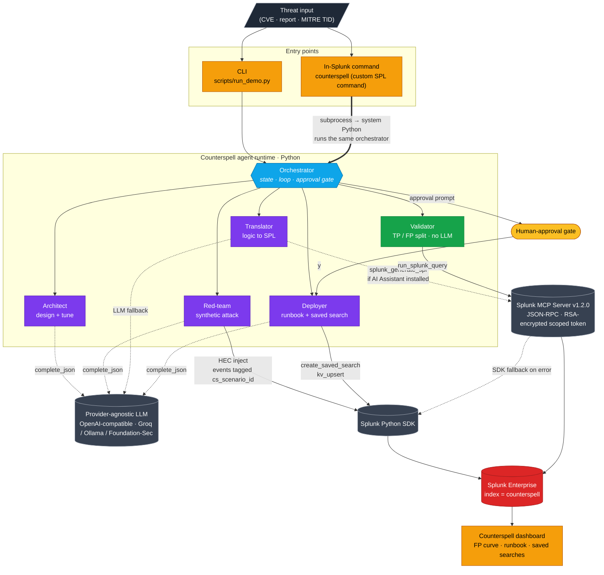
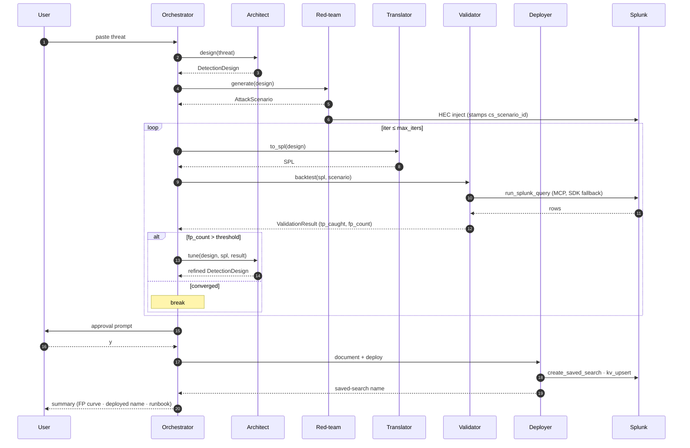

# Counterspell Architecture

> This file is the architecture diagram of record. GitHub renders the Mermaid
> blocks below directly, so the diagram lives in the repo root as required.
> (Optional: export a PNG via the Mermaid CLI / VS Code preview for slides.)
>
> It shows the three things the submission asks for:
> 1. **How the app interacts with Splunk** — HEC inject, MCP `splunk_run_query`,
>    SDK `create_saved_search` / KV upsert, the in-Splunk custom command, and the
>    dashboard reading back.
> 2. **How the AI agents/models are integrated** — five agents driven by a
>    provider-agnostic OpenAI-compatible model; the Validator is deterministic.
> 3. **Data flow between services, APIs, and components** — the sequence diagram.

## System diagram

## Data flow (the one-loop summary)

## Failure isolation matrix

| Failure | Detected at | Fallback |
|---|---|---|
| MCP unreachable | `MCPClient.run_query` | Direct SDK `oneshot()` |
| AI Assistant `splunk_generate_spl` absent/empty | `Translator.to_spl` | LLM-drafted SPL via `complete_json(SplOutput)` (this is the path on a stock MCP install without the AI Assistant add-on) |
| LLM returns malformed JSON | `LLMClient.complete_json` | One repair-retry with the validation error in-prompt |
| Backtest result set too large | (design) | All SPL is `stats`/`tstats`-aggregated; rows < 1k |
| Loop fails to converge in `max_iters` | `Orchestrator.run` | Emit `incomplete`, return state without deploying |
| User declines deploy | `Orchestrator._confirm` | Emit `declined`, return state without writing |

## Why MCP for reads, SDK for writes

| Operation | Tool | Reason |
|---|---|---|
| `splunk_run_query` (backtest) | MCP | Every backtest runs through MCP; run logs record `used_mcp=true`. The MCP server is built for this. |
| `splunk_generate_spl` (translate) | MCP → LLM | Used when the AI Assistant for SPL add-on is installed; otherwise the Translator falls back to the LLM. |
| HEC inject (red-team events) | SDK | MCP server (v1.2.0) has no HEC tool; SDK is the supported path. |
| Saved-search create (the headline write) | SDK | MCP server exposes no generic "create knowledge object." |
| KV store upsert (runbook) | SDK | Direct REST via the SDK's auth context. |

Both clients hit the same Splunk instance under the same dedicated service
account scoped to `index=counterspell`. The agent runtime is the single point
of trust.
